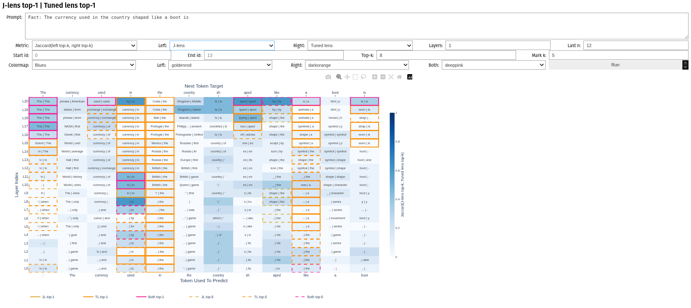

# mi-lens


Project-owned toolkit for comparing **logit lens**, **tuned lens**, and **J-lens** readouts on the same prompts, layers, and models. The repository vendors the exact `jlens` and `tuned_lens` code used in the experiments, and adds local plotting, widget, and evaluation utilities for side-by-side analysis.



The current examples and analysis notebooks focus on `TinyLlama/TinyLlama-1.1B-Chat-v1.0`, but the repository is structured to support broader lens experiments, including Pythia-style models, through the vendored packages and local analysis modules.

## Lens Readouts

Let `h_l` be the residual stream at layer `l`, `N` the model's final normalization, and `U` the unembedding matrix.

- **Logit lens** reads out intermediate predictions by prematurely applying the model's final readout:
  `z_l = U(N(h_l))`
- **Tuned lens** learns a layer-specific translator `T_l` before unembedding:
  `z_l = U(N(h_l + T_l(h_l)))`
- **J-lens** transports `h_l` through a fitted Jacobian map `J_l` before unembedding:
  `z_l = U(N(J_l h_l))`

## Evaluation

We compare lenses along three complementary axes:

- **Verbatim fidelity**: exact-token metrics such as top-1, top-k, gold rank, and gold probability.
- **Surface/gist proxy**: softer overlap metrics based on normalized token forms and top-k character n-gram similarity.
- **Mechanistic faithfulness**: hidden-space agreement with the model's actual final residual, measured with cosine similarity and relative `L2` error.

These metrics are implemented in the local `methods` package and used throughout the notebooks and comparison widgets.

## Reproducible Data Prep

For reproducibility, keep lens fit/train/eval data as fixed JSONL exports rather than regenerating slices inside notebooks.

- Load Hugging Face splits in source order and do not shuffle during export.
- Export more rows than the current pilot run needs, so later scale-up can extend the same split by index instead of sampling a different subset.
- Keep training/fit data on the dataset `train` split when available, and keep evaluation on `validation` or `test`.
- Store source indices and a manifest hash beside each JSONL file.
- A simple repository layout is:
  `data/train_fit` for plain-text lens fit/train exports and `data/eval` for held-out evaluation exports.

The local `methods` package includes helpers for this:

```python
from pathlib import Path

from methods import (
    MKQAExportSpec,
    TextExportSpec,
    export_mkqa_to_jsonl,
    export_text_split_to_jsonl,
    project_data_paths,
    write_dataset_registry,
)

ROOT = Path("/media/am/AM/mi-lens")
PATHS = project_data_paths(ROOT)

plain_da_manifest = export_text_split_to_jsonl(
    TextExportSpec(
        dataset_name="YOUR_DANISH_TEXT_DATASET",
        split="train",
        text_field="text",
        start_idx=0,
        max_records=5000,
        output_path=PATHS.train_fit_dir / "plain_da_train_5000.jsonl",
    )
)

plain_en_manifest = export_text_split_to_jsonl(
    TextExportSpec(
        dataset_name="YOUR_ENGLISH_TEXT_DATASET",
        split="train",
        text_field="text",
        start_idx=0,
        max_records=5000,
        output_path=PATHS.train_fit_dir / "plain_en_train_5000.jsonl",
    )
)

mkqa_da_manifest = export_mkqa_to_jsonl(
    MKQAExportSpec(
        split="validation",
        question_language="da",
        answer_language="da",
        start_idx=0,
        max_records=1000,
        output_path=PATHS.eval_dir / "mkqa_da_val_1000.jsonl",
    )
)

mkqa_en_manifest = export_mkqa_to_jsonl(
    MKQAExportSpec(
        split="validation",
        question_language="en",
        answer_language="en",
        start_idx=0,
        max_records=1000,
        output_path=PATHS.eval_dir / "mkqa_en_val_1000.jsonl",
    )
)

write_dataset_registry(
    PATHS.registry_path,
    [
        plain_da_manifest,
        plain_en_manifest,
        mkqa_da_manifest,
        mkqa_en_manifest,
    ],
    note="Unshuffled fixed exports for lens fit/train/eval.",
)
```

## Install

```bash
conda env create -f environment.yml
conda activate mi-lens
scripts/install_environment.sh
```

This creates the supported Python 3.12 environment and installs the checked-in
project package, including:

- `jlens`
- `tuned_lens`
- `mi_lens`

For FlexOlmo/FlexDanish runs that require the project-specific Transformers
fork, install it into the same environment:

```bash
scripts/install_environment.sh \
  --flex-transformers /work/.../transformers
```

The script prints the loaded `transformers` path and version. Router and lens
run metadata records the same information. All project caches and RouterInterp
artifacts are written below `tmp/`.

The vendored `jlens` and `tuned_lens` sources are tracked in this repository.
Other cloned research repositories are not runtime dependencies until they are
integrated as pinned Git submodules or vendored sources.

## Repository Layout

- `lenses/jacobian_lens`: vendored Jacobian Lens code.
- `lenses/tuned_logit_lens`: vendored Tuned Lens / Logit Lens code.
- `src/plotting`: local widgets and comparison plots.
- `src/methods`: local evaluation helpers, including fuzzy-trace-style metrics and residual-alignment analyses.
- `notebooks`: exploratory analysis and comparison notebooks.

## Current Focus

The repository is currently centered on:

- pairwise lens comparison widgets for `logit lens`, `J-lens`, and `tuned lens`
- prompt-level and layerwise analysis on TinyLlama
- evaluation pipelines that separate predictive fit from more mechanistic hidden-state agreement

For deeper examples, see the notebooks under `notebooks/`.
