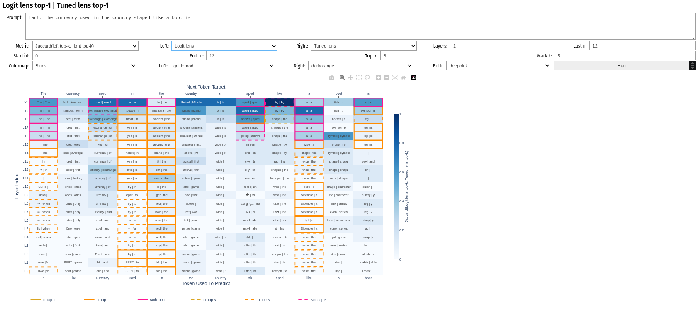
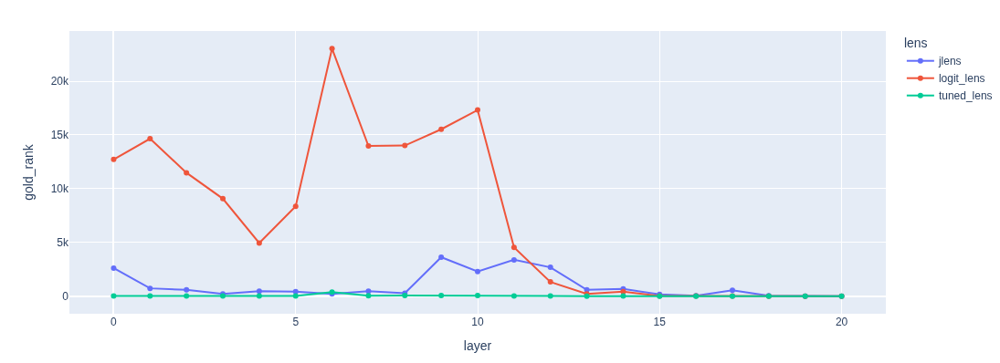
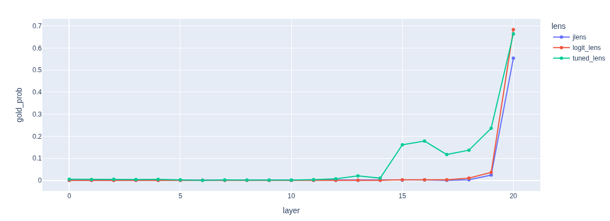
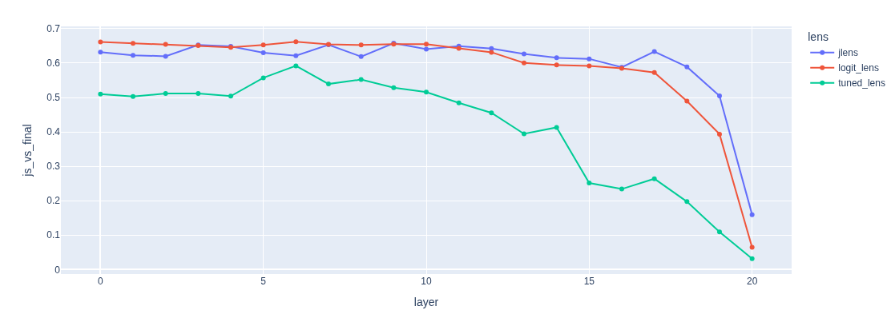
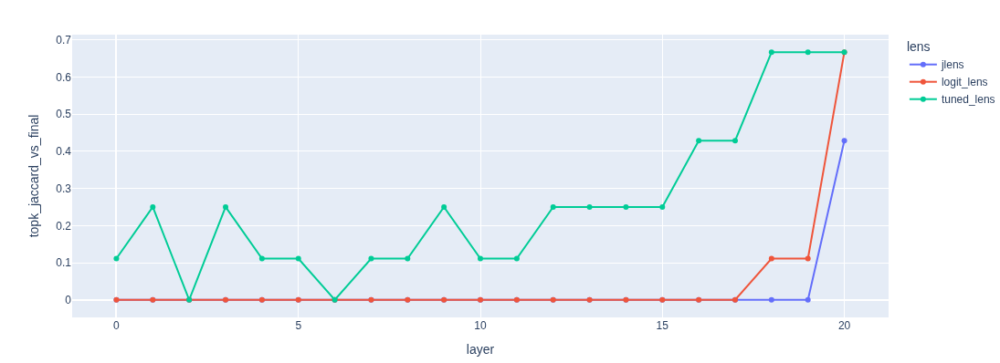

# mi-lens

## Examples using TinyLlama/TinyLlama-1.1B-Chat-v1.0
### Lens diff interactive heatmap widgets



### Lens diff layer-wise





Project-owned lens analysis toolkit with vendored `jlens` and `tuned_lens` code,
plus local plotting and evaluation methods for comparing lens readouts.

## Install

```bash
pip install -e .
```

This installs the exact checked-in versions of:
- `jlens`
- `tuned_lens`
- `plotting`
- `methods`
